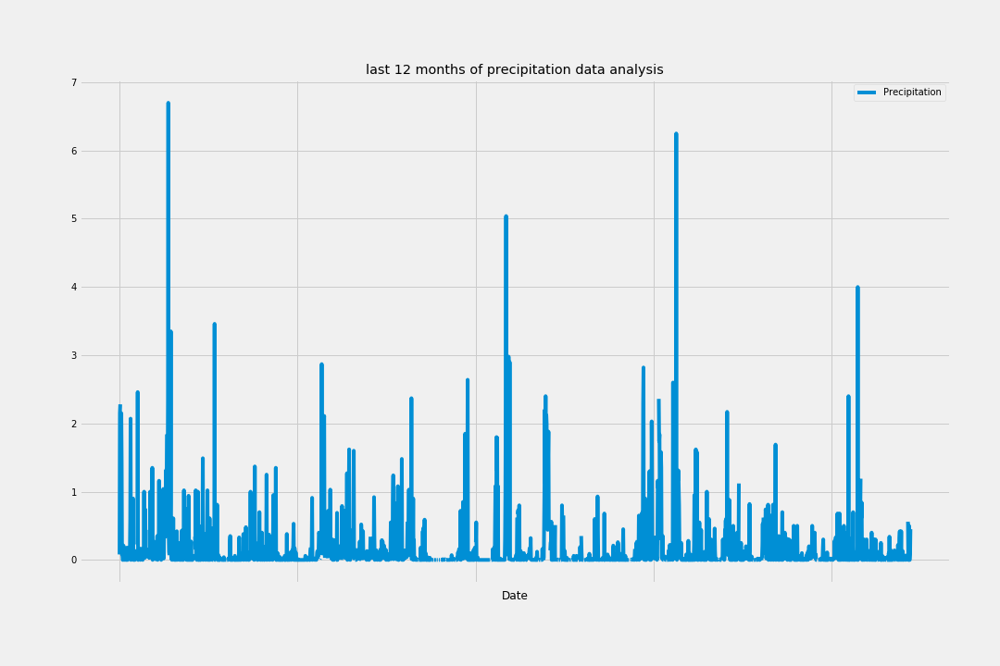
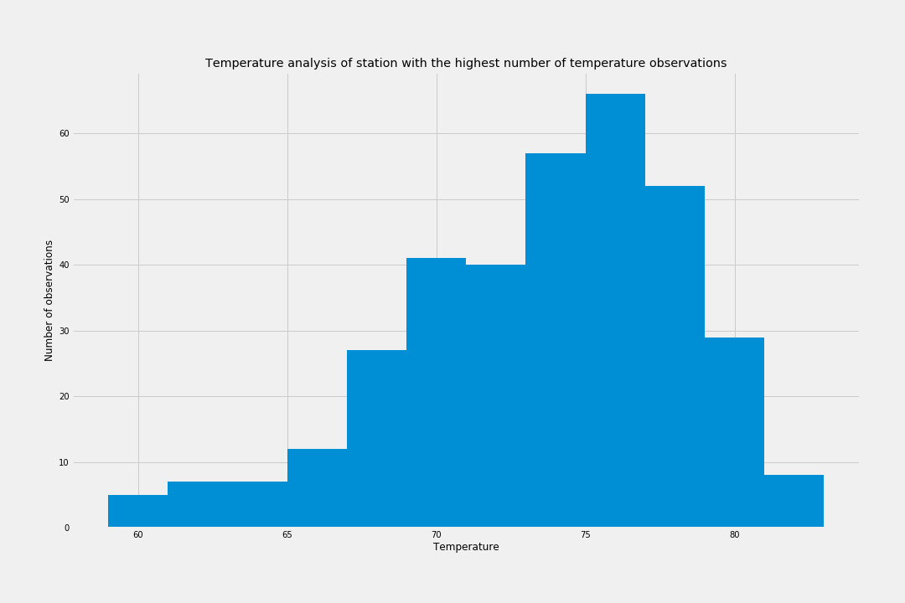
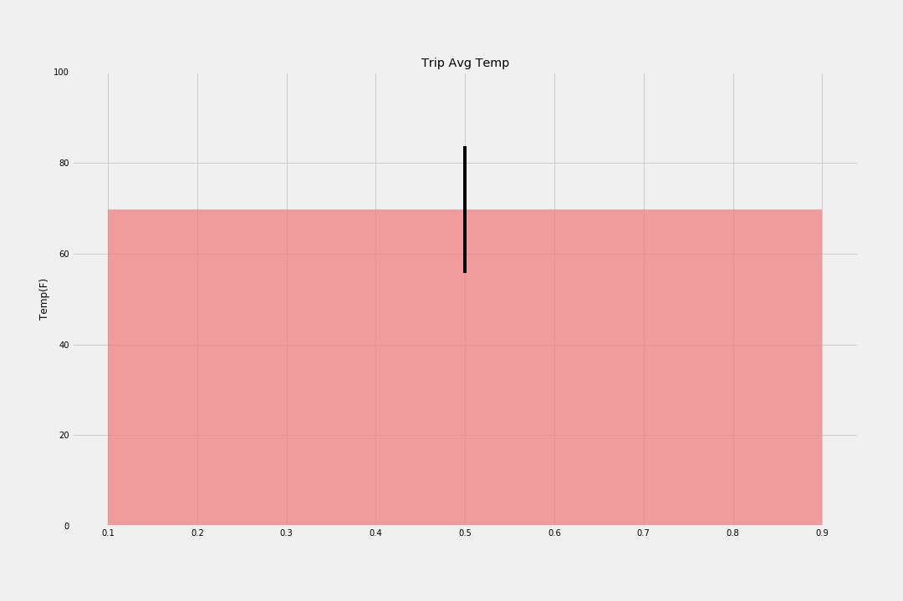

# Climate Analysis and Exploration

This project is for doing climate analysis of Hawaii, using SQLAlchemy and designing a Flask API based on the queries.

## Technologies/Framework Used:
### Database
* sqlite
### Programming languages/tools/libraries
* Python
* SQLAlchemy ORM queries
* pandas
* numpy
* matplotlib
* JSON Traversals
* Flask API

"------------------------------------------------------------------------------------------------------------------------------------"
### Using SQLAlchemy create_engine to connect to sqlite database
### Using SQLALchemy automap_base() to reflect tables into classes and save reference as variables
"------------------------------------------------------------------------------------------------------------------------------------"
```python
# Importing dependies for visualizations
%matplotlib inline
from matplotlib import style
style.use('fivethirtyeight')
import matplotlib.pyplot as plt
```


```python
# Importing python libraries
import numpy as np
import pandas as pd
```


```python
# importing datetime module
import datetime as dt
```

# Reflect Tables into SQLAlchemy ORM


```python
# Python SQL toolkit and object relational mapper
import sqlalchemy
from sqlalchemy.ext.automap import automap_base
from sqlalchemy.orm import Session
from sqlalchemy import create_engine, func
```


```python
engine = create_engine("sqlite:///Resources/hawaii.sqlite")
```


```python
# reflect an existing database into a new model
Base = automap_base()
# reflect the tables
Base.prepare(engine, reflect=True)
```


```python
# View all the classes automap found
Base.classes.keys()
```


    ['measurement', 'station']


```python
# Save references of each table in variables
Measurement = Base.classes.measurement
Station = Base.classes.station
```


```python
# Create session link from Python to Database
session = Session(engine)
```


```python
first_row_measurement = session.query(Measurement).first()
first_row_measurement.__dict__
```


    {'_sa_instance_state': <sqlalchemy.orm.state.InstanceState at 0x1cf1edaa5f8>,
     'prcp': 0.08,
     'station': 'USC00519397',
     'tobs': 65.0,
     'date': '2010-01-01',
     'id': 1}


```python
first_row_station = session.query(Station).first()
first_row_station.__dict__
```


    {'_sa_instance_state': <sqlalchemy.orm.state.InstanceState at 0x1cf1edb8240>,
     'elevation': 3.0,
     'longitude': -157.8168,
     'name': 'WAIKIKI 717.2, HI US',
     'id': 1,
     'latitude': 21.2716,
     'station': 'USC00519397'}


# Exploratory Climate Analysis


```python
# Design a query to retrieve the last 12 months of precipitation data and plot the results
# last date in the table
last_date = session.query(Measurement.date).order_by(Measurement.date.desc()).first()
print(last_date)
```

    ('2017-08-23',)
    


```python
# Calculate the date 1 year ago from the last data point in the database
year_ago = dt.date(2017,8,23) - dt.timedelta(days=365)
print(year_ago)
```

    2016-08-23
    


```python
# Perform a query to retrieve the data and precipitation scores
prcp_scores = session.query(Measurement.date, Measurement.prcp).filter(Measurement.date > year_ago).order_by(Measurement.date).all()
#for prcp in prcp_scores:
    #print(prcp)
```


```python
# Save the query results as a Pandas DataFrame and set the index to the date column
prcp_df = pd.DataFrame(prcp_scores)
prcp_df.head().set_index('date')
```


<div>
<style scoped>
    .dataframe tbody tr th:only-of-type {
        vertical-align: middle;
    }

    .dataframe tbody tr th {
        vertical-align: top;
    }

    .dataframe thead th {
        text-align: right;
    }
</style>
<table border="1" class="dataframe">
  <thead>
    <tr style="text-align: right;">
      <th></th>
      <th>prcp</th>
    </tr>
    <tr>
      <th>date</th>
      <th></th>
    </tr>
  </thead>
  <tbody>
    <tr>
      <th>2016-08-24</th>
      <td>0.08</td>
    </tr>
    <tr>
      <th>2016-08-24</th>
      <td>2.15</td>
    </tr>
    <tr>
      <th>2016-08-24</th>
      <td>2.28</td>
    </tr>
    <tr>
      <th>2016-08-24</th>
      <td>NaN</td>
    </tr>
    <tr>
      <th>2016-08-24</th>
      <td>1.22</td>
    </tr>
  </tbody>
</table>
</div>


```python
#Sort the dataframe by date
prcp_df.sort_values(by='date').head()
```


<div>
<style scoped>
    .dataframe tbody tr th:only-of-type {
        vertical-align: middle;
    }

    .dataframe tbody tr th {
        vertical-align: top;
    }

    .dataframe thead th {
        text-align: right;
    }
</style>
<table border="1" class="dataframe">
  <thead>
    <tr style="text-align: right;">
      <th></th>
      <th>date</th>
      <th>prcp</th>
    </tr>
  </thead>
  <tbody>
    <tr>
      <th>0</th>
      <td>2016-08-24</td>
      <td>0.08</td>
    </tr>
    <tr>
      <th>1</th>
      <td>2016-08-24</td>
      <td>2.15</td>
    </tr>
    <tr>
      <th>2</th>
      <td>2016-08-24</td>
      <td>2.28</td>
    </tr>
    <tr>
      <th>3</th>
      <td>2016-08-24</td>
      <td>NaN</td>
    </tr>
    <tr>
      <th>4</th>
      <td>2016-08-24</td>
      <td>1.22</td>
    </tr>
  </tbody>
</table>
</div>


```python
plt.rcParams['figure.figsize'] = [15,10]
```
"------------------------------------------------------------------------------------------------------------------------------------/n"
# Precipitation Analysis
* Designing a query to retrieve the last 12 months of precipitation data
* Loading the query results into a Pandas DataFrame
* Using Pandas to print the summary statistics and Matplotlib to plot the results
"------------------------------------------------------------------------------------------------------------------------------------/n"

```python
# Use Pandas Plotting with Matplotlib to plot the data
prcp_df.plot('date','prcp')
plt.xlabel("Date")
plt.title("last 12 months of precipitation data analysis")
plt.legend(["Precipitation"])
plt.savefig("precipitation.png")
plt.show()
```





```python
# Use Pandas to calcualte the summary statistics for the precipitation data
prcp_df.describe()
```


<div>
<style scoped>
    .dataframe tbody tr th:only-of-type {
        vertical-align: middle;
    }

    .dataframe tbody tr th {
        vertical-align: top;
    }

    .dataframe thead th {
        text-align: right;
    }
</style>
<table border="1" class="dataframe">
  <thead>
    <tr style="text-align: right;">
      <th></th>
      <th>prcp</th>
    </tr>
  </thead>
  <tbody>
    <tr>
      <th>count</th>
      <td>2015.000000</td>
    </tr>
    <tr>
      <th>mean</th>
      <td>0.176462</td>
    </tr>
    <tr>
      <th>std</th>
      <td>0.460288</td>
    </tr>
    <tr>
      <th>min</th>
      <td>0.000000</td>
    </tr>
    <tr>
      <th>25%</th>
      <td>0.000000</td>
    </tr>
    <tr>
      <th>50%</th>
      <td>0.020000</td>
    </tr>
    <tr>
      <th>75%</th>
      <td>0.130000</td>
    </tr>
    <tr>
      <th>max</th>
      <td>6.700000</td>
    </tr>
  </tbody>
</table>
</div>
"------------------------------------------------------------------------------------------------------------------------------------/n"
# Station Analysis
* Designing a query to calculate the total number of stations.
* Designing a query to find the most active stations.
* Designing a query to retrieve the last 12 months of temperature observation data
"------------------------------------------------------------------------------------------------------------------------------------/n"


```python
# Design a query to show how many stations are available in this dataset?
stations_count = session.query(Measurement).group_by(Measurement.station).count()
print(stations_count)
```

    9
    


```python
# What are the most active stations? (i.e. what stations have the most rows)?
# List the stations and the counts in descending order.
active_stations = session.query(Measurement.station, func.count(Measurement.id)).group_by(Measurement.station).\
order_by(func.count(Measurement.id).desc()).all()

most_active = active_stations[0][0]
for station, count in active_stations:
    print(station,count)
print(f'Most Active Station:{most_active}')
```

    USC00519281 2772
    USC00519397 2724
    USC00513117 2709
    USC00519523 2669
    USC00516128 2612
    USC00514830 2202
    USC00511918 1979
    USC00517948 1372
    USC00518838 511
    Most Active Station:USC00519281
    


```python
# Using the station id from the previous query, calculate the lowest temperature recorded, 
# highest temperature recorded, and average temperature most active station?
temp = session.query(Measurement.station, func.min(Measurement.tobs), func.max(Measurement.tobs),\
                     func.avg(Measurement.tobs)).filter(Measurement.station == most_active).group_by(Measurement.station)
for station,lowest_temp,highest_temp,avg_temp in temp:
    print(lowest_temp,highest_temp,avg_temp)
```

    54.0 85.0 71.66378066378067
    


```python
# Choose the station with the highest number of temperature observations.
# Query the last 12 months of temperature observation data for this station and plot the results as a histogram
temperature = session.query(Measurement.station, Measurement.date, Measurement.tobs).\
filter(Measurement.station == most_active).\
filter(Measurement.date > year_ago).\
order_by(Measurement.date).all()

temp_df = pd.DataFrame(temperature)
temp_df.head()
```


<div>
<style scoped>
    .dataframe tbody tr th:only-of-type {
        vertical-align: middle;
    }

    .dataframe tbody tr th {
        vertical-align: top;
    }

    .dataframe thead th {
        text-align: right;
    }
</style>
<table border="1" class="dataframe">
  <thead>
    <tr style="text-align: right;">
      <th></th>
      <th>station</th>
      <th>date</th>
      <th>tobs</th>
    </tr>
  </thead>
  <tbody>
    <tr>
      <th>0</th>
      <td>USC00519281</td>
      <td>2016-08-24</td>
      <td>77.0</td>
    </tr>
    <tr>
      <th>1</th>
      <td>USC00519281</td>
      <td>2016-08-25</td>
      <td>80.0</td>
    </tr>
    <tr>
      <th>2</th>
      <td>USC00519281</td>
      <td>2016-08-26</td>
      <td>80.0</td>
    </tr>
    <tr>
      <th>3</th>
      <td>USC00519281</td>
      <td>2016-08-27</td>
      <td>75.0</td>
    </tr>
    <tr>
      <th>4</th>
      <td>USC00519281</td>
      <td>2016-08-28</td>
      <td>73.0</td>
    </tr>
  </tbody>
</table>
</div>


```python
plt.hist(temp_df['tobs'],12)
plt.xlabel("Temperature")
plt.ylabel("Number of observations")
plt.title("Temperature analysis of station with the highest number of temperature observations")
plt.savefig("temperature.png")
plt.show()
```





```python
# This function called `calc_temps` will accept start date and end date in the format '%Y-%m-%d' 
# and return the minimum, average, and maximum temperatures for that range of dates
def calc_temps(start_date, end_date):
    """TMIN, TAVG, and TMAX for a list of dates.
    
    Args:
        start_date (string): A date string in the format %Y-%m-%d
        end_date (string): A date string in the format %Y-%m-%d
        
    Returns:
        TMIN, TAVE, and TMAX
    """
    
    return session.query(func.min(Measurement.tobs), func.avg(Measurement.tobs), func.max(Measurement.tobs)).\
        filter(Measurement.date >= start_date).filter(Measurement.date <= end_date).all()

# function usage example
print(calc_temps('2012-02-28', '2012-03-05'))
```

    [(62.0, 69.57142857142857, 74.0)]
    


```python
# Use your previous function `calc_temps` to calculate the tmin, tavg, and tmax 
# for your trip using the previous year's data for those same dates.
temps_2011 = calc_temps('2011-02-28','2011-03-05')
temps_2011
```


    [(61.0, 69.75510204081633, 75.0)]


```python
# Plot the results from your previous query as a bar chart. 
# Use "Trip Avg Temp" as your Title
# Use the average temperature for the y value
# Use the peak-to-peak (tmax-tmin) value as the y error bar (yerr)
calc_temps_df = pd.DataFrame(temps_2011,columns=['tmin','tavg','tmax'])
calc_temps_df
```


<div>
<style scoped>
    .dataframe tbody tr th:only-of-type {
        vertical-align: middle;
    }

    .dataframe tbody tr th {
        vertical-align: top;
    }

    .dataframe thead th {
        text-align: right;
    }
</style>
<table border="1" class="dataframe">
  <thead>
    <tr style="text-align: right;">
      <th></th>
      <th>tmin</th>
      <th>tavg</th>
      <th>tmax</th>
    </tr>
  </thead>
  <tbody>
    <tr>
      <th>0</th>
      <td>61.0</td>
      <td>69.755102</td>
      <td>75.0</td>
    </tr>
  </tbody>
</table>
</div>


```python
from matplotlib.pyplot import figure
```


```python
error = calc_temps_df['tmax'] - calc_temps_df ['tmin']
plt.bar(0.5,calc_temps_df['tavg'], yerr = error, color = 'lightcoral', alpha=0.75)
plt.ylabel("Temp(F)")
plt.title("Trip Avg Temp")
plt.ylim(0,100)
plt.rc('figure', figsize=(10, 6))
plt.savefig("avgtemp.png")
plt.show()
```



"------------------------------------------------------------------------------------------------------------------------------------"
# Climate App
* Designing a Flask API based on the queries
* Using Flask jsonify to convert API data into a valid JSON response object
"------------------------------------------------------------------------------------------------------------------------------------"

#### import Flask
from flask import Flask, jsonify

#### Create an app
app = Flask(__name__)


import numpy as np
import sqlalchemy
from sqlalchemy.ext.automap import automap_base
from sqlalchemy.orm import Session
from sqlalchemy import create_engine, func
import datetime as dt

#### Database Setup
engine = create_engine("sqlite:///Resources/hawaii.sqlite")

#### reflect an existing database into a new model
Base = automap_base()

#### reflect the tables
Base.prepare(engine, reflect=True)

#### Save reference to the table
Measurement = Base.classes.measurement
Station = Base.classes.station

#### Create our session (link) from Python to the DB
session = Session(engine)

#### Flask Routes

@app.route("/")
def welcome():
    """List all available api routes."""
    return (
        f"Available Routes:<br/>"
        f"/api/v1.0/precipitation<br/>"
        f"/api/v1.0/stations<br/>"
        f"/api/v1.0/tobs<br/>"
        f"/api/v1.0/<start_date><br/>"
        f"/api/v1.0/<start_date>/<end_date>"
    )


@app.route("/api/v1.0/precipitation")
def precipitation():
    results = session.query(Measurement).all()

    # Create a dictionary from the row data and append to a list of all_precipitations
    all_precipitations = []
    for p in results:
        precipitation_dict = {}
        precipitation_dict["date"] = p.date
        precipitation_dict["tobs"] = p.tobs
        all_precipitations.append(precipitation_dict)

    return jsonify(all_precipitations)

@app.route("/api/v1.0/stations")
def stations():
    # query all stations
    results = session.query(Measurement.station).all()
    
     # Convert list of tuples into normal list
    all_stations = list(np.ravel(results))
    
    return jsonify(all_stations)


@app.route("/api/v1.0/tobs")
def tobs():
    results = session.query(Measurement.tobs).all()
    all_tobs = list(np.ravel(results))
    return jsonify(all_tobs)

@app.route("/api/v1.0/<start_date>")
def calc_temps(start_date):

    
    result=session.query(func.min(Measurement.tobs), func.avg(Measurement.tobs), func.max(Measurement.tobs)).\
        filter(Measurement.date >= start_date).all()

    # Convert the query results to a Dictionary using date as the key and tobs as the value.
    tobs=[]
    for row in result:
        tobs_dict = {}
        tobs_dict["TMIN"] = row[0]
        tobs_dict["TAVG"] = row[1]
        tobs_dict["TMAX"] = row[2]
        tobs.append(tobs_dict)

    return jsonify(tobs)

@app.route("/api/v1.0/<start_date>/<end_date>")
def calc_temps_dates(start_date, end_date):

    result=session.query(func.min(Measurement.tobs), func.avg(Measurement.tobs), func.max(Measurement.tobs)).\
        filter(Measurement.date >= start_date).\
        filter(Measurement.date <= end_date).all()
    
    # Convert the query results to a Dictionary using date as the key and tobs as the value.
    tobs=[]
    for row in result:
        tobs_dict = {}
        tobs_dict["TMIN"] = row[0]
        tobs_dict["TAVG"] = row[1]
        tobs_dict["TMAX"] = row[2]
        tobs.append(tobs_dict)

    return jsonify(tobs)
    
if __name__ == '__main__':
    app.run(debug=True)
